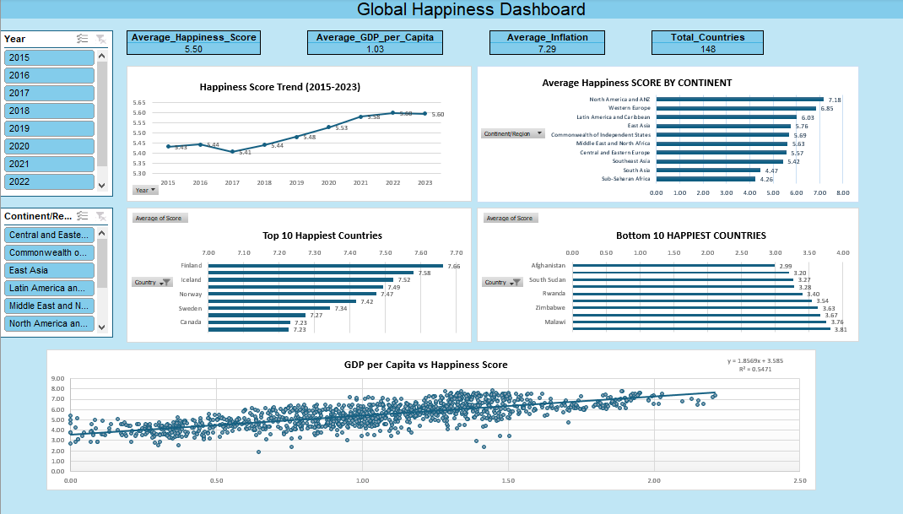

# 🌍 Global Happiness & Inflation Analysis Dashboard

### 📌 Project Overview

This project presents an end-to-end data analysis of the **Global Happiness & Inflation Dataset** using **Microsoft Excel**. The objective was to clean and prepare the dataset, perform Exploratory Data Analysis (EDA), analyze relationships between economic and happiness indicators and build an interactive dashboard to uncover meaningful insights.

The project demonstrates practical Excel skills including data cleaning, missing value treatment, Pivot Tables, Pivot Charts, interactive slicers, statistical analysis and dashboard design.

---

### 🎯 Project Objectives

- Clean and prepare the dataset for analysis.
- Handle missing values using appropriate statistical techniques.
- Perform Exploratory Data Analysis (EDA).
- Analyze happiness trends across countries, continents and years.
- Explore relationships between GDP, inflation, corruption, social support and happiness.
- Build an interactive dashboard for data-driven decision making.
- Generate actionable business insights and recommendations.

---

### 🛠️ Tools & Features Used

- Microsoft Excel
- Excel Tables
- Data Cleaning
- Missing Value Treatment
- Mean & Median Imputation
- Descriptive Statistics
- Pivot Tables
- Pivot Charts
- Scatter Plots
- Trendlines
- Slicers
- KPI Cards
- Data Visualization

---

### 📂 Dataset Information

The dataset contains global economic and happiness indicators for multiple countries between **2015 and 2023**.

### Key Columns

- Country
- Year
- Happiness Score
- GDP per Capita
- Headline Consumer Price Inflation
- Energy Consumer Price Inflation
- Food Consumer Price Inflation
- Official Core Consumer Price Inflation
- Producer Price Inflation
- GDP Deflator Index Growth Rate
- Social Support
- Healthy Life Expectancy
- Freedom to Make Life Choices
- Generosity
- Perceptions of Corruption
- Continent / Region

---

### 🧹 Data Cleaning

The following preprocessing steps were performed before analysis:

- Converted raw data into an Excel Table.
- Corrected data types for all columns.
- Checked missing values for every numerical column.
- Calculated missing value percentages.
- Used **Median Imputation** for skewed distributions and columns containing outliers.
- Used **Mean Imputation** for approximately normal distributions with minimal missing values.
- Rounded numerical values to maintain formatting consistency.
- Created a separate documentation sheet describing missing value treatment.

---

### 📊 Descriptive Statistics

Calculated descriptive statistics for all numerical columns including:

- Mean
- Median
- Minimum
- Maximum
- Missing Value Percentage

These statistics were used to understand the data distribution and determine appropriate missing value treatment techniques.

---

### 📈 Exploratory Data Analysis (EDA)

Performed exploratory analysis to answer key business questions including:

- Average Happiness Score by Continent
- Top 10 Happiest Countries
- Bottom 10 Happiest Countries
- Happiness Trend (2015–2023)
- GDP Analysis
- Inflation Analysis
- Continent-wise Comparison
- Country-wise Performance

---

### 🔍 Relationship Analysis

Scatter plots with trendlines were created to understand relationships between variables.

Relationships analyzed include:

- GDP per Capita vs Happiness Score
- Inflation vs Happiness Score
- Social Support vs Happiness Score
- Freedom to Make Life Choices vs Happiness Score
- Perceptions of Corruption vs Happiness Score

Trendlines and **R² values** were used to understand the strength and direction of relationships.

---

### 📊 Dashboard Features

The interactive dashboard includes:

- KPI Cards
  - Average Happiness Score
  - Average GDP per Capita
  - Average Inflation
  - Total Countries

- Line Chart
  - Happiness Trend (2015–2023)

- Bar Charts
  - Average Happiness by Continent
  - Top 10 Happiest Countries
  - Bottom 10 Happiest Countries

- Scatter Plot
  - GDP per Capita vs Happiness Score

- Interactive Slicers
  - Year
  - Continent / Region

---

### 💡 Key Insights

1. North America & ANZ recorded the highest average happiness score, while Sub-Saharan Africa recorded the lowest average happiness score.

2. The Top 10 Happiest Countries consistently outperformed the Bottom 10 Countries in terms of overall happiness scores.

3. Global happiness remained relatively stable between 2015 and 2023 with only gradual year-to-year changes.

4. A positive relationship exists between GDP per Capita and Happiness Score, indicating that countries with stronger economies generally report higher happiness levels.

5. Regional comparisons reveal significant differences in happiness levels across continents, highlighting varying economic and social conditions.

---

### ✅ Recommendations

- Countries with lower happiness scores should study the economic and social policies adopted by higher-performing countries to identify practices that could improve overall well-being.

- Governments should promote sustainable economic growth and employment opportunities, as higher GDP per Capita is positively associated with higher happiness scores.

- Regions with consistently lower happiness scores should receive targeted economic and social development initiatives while monitoring progress over time.

- Policymakers should continuously monitor happiness and economic indicators to evaluate the long-term impact of public policies.

- Governments can benchmark measurable practices from the top-performing countries while adapting them to their own economic and social conditions.

---

### 📷 Dashboard Preview

The dashboard provides an interactive overview of global happiness and economic indicators. It includes KPI cards, trend analysis, continent-wise comparisons, country rankings, relationship analysis, and interactive slicers for dynamic exploration.



---

### 📁 Repository Contents

```
Global_Happiness_Inflation_Analysis_Dashboard.xlsx
dashboard.png
README.md
```

---

### 🚀 Skills Demonstrated

- Data Cleaning
- Data Preprocessing
- Missing Value Handling
- Descriptive Statistics
- Exploratory Data Analysis (EDA)
- Pivot Tables
- Pivot Charts
- Dashboard Design
- Data Visualization
- Business Insights
- Data Storytelling
- Microsoft Excel

---

### 📌 Conclusion

This project demonstrates an end-to-end data analytics workflow using Microsoft Excel, from raw data preparation to interactive dashboard creation. The analysis highlights how economic indicators such as GDP per Capita relate to happiness while enabling users to explore trends through dynamic visualizations and slicers. The project showcases practical Excel skills commonly used in business intelligence and data analytics roles.

---

### 👩‍💻 Author

**Hafsa Ali**

If you found this project interesting, feel free to connect with me on LinkedIn or explore my other data analytics projects.
